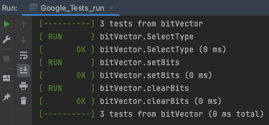
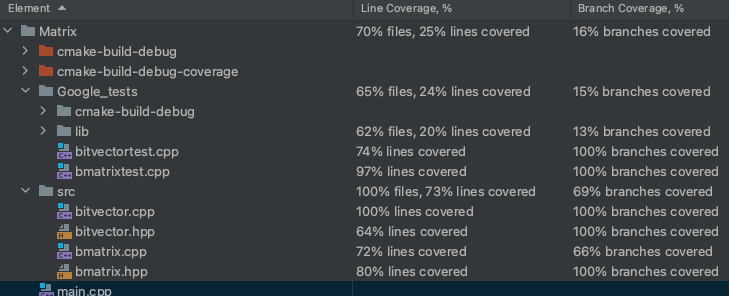

# How to use/setup GoogleTests for C++ using the CLion IDE.



**Project**

The project is a library for boolean matrix operations. It uses a bitwise operations to represent the boolean values of
matrix. The idea is to explore unit testing in C++ using the CLion IDE and compare with
testing Go code in the Goland IDE.

**Sources**

I have created a CLion project named Matrix and added it to github. The Matrix sources are placed in a folder src.
```
bitvector.cpp
bitvector.hpp
bmatrix.cpp
bmatrix.hpp
```
Install Google Test from: https://www.jetbrains.com/help/clion/creating-google-test-run-debug-configuration-for-test.html#add-google-tests
Directly under Google_tests I have placed my testfiles.
```
bitvectortest.cpp
bmatrixtest.cpp
```

Running tests with coverage, select from the main menu *RUN* and *Run with coverage* , if not built with coverage flags just select 
*fix and run* and the IDE will take care of it and build and run the tests.




    
